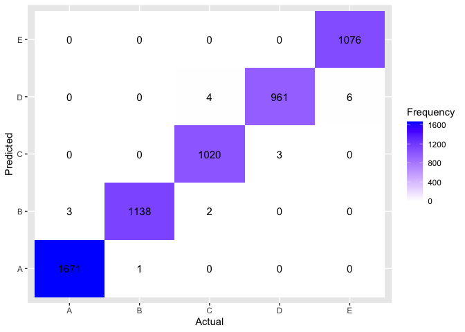

# Practical Machine Learning Project

## Summary

In this project, the goal was to use data from an exercise study measured using accelerometers - and using this data to predict the exercise they performed, the "classe" variable. More information about the study is available from the website here: http://web.archive.org/web/20161224072740/http:/groupware.les.inf.puc-rio.br/har

Machine learning was to be used in this project to predict such classes. Random forests was selected as the appropriate algorithm, with cross-validation.
The model had an out of bag estimate of error rate of 0.25% and an out of sample error rate of 0.01%. 

This model was later used to predict the classes of a test set containing 20 entries for the Week 4 Practical Machine Learning Coursera quiz.


## Packages

Firstly, the appropriate packages to be used throughout the project were loaded, as well as setting the seed for reproducibility.


```r
library(dplyr)
library(ggplot2)
library(caret)
library(randomForest)
library(parallel)
library(doParallel)
set.seed(123)
```

## Data

### Loading
The data to be used was downloaded. More detail about the data set can be found here http://web.archive.org/web/20161224072740/http:/groupware.les.inf.puc-rio.br/har. It contained 160 variables in its raw state, with 19622 observations.


```r
fileUrl1 <- "https://d396qusza40orc.cloudfront.net/predmachlearn/pml-training.csv"
filename1 <- "pml-training.csv"

if(!file.exists(filename1)) {
          download.file(fileUrl1,destfile=filename1,method="curl")
}

data <- read.csv("pml-training.csv", header = TRUE, na.strings = "NA")
```

### Cleaning

The data was then cleaned, selecting the most appropriate variables to be used in the model, with the aim of increasing accuracy and reducing computational time. 


```r
data <- select(data, -(1:5))
data$classe <- as.factor(data$classe)
```

Details of some of the variables have been lost through time, but the classe variable is what was important for the purposes of the project. It was to be assumed the first 5 variables in this dataset were not related to participant outcomes hence they were removed. The classe variable was converted to a factor variable to allow its categorization.


```r
data <- data[,colMeans(is.na(data)) < .5]
nvz <- nearZeroVar(data)
data <- data[,-nvz]
```

Variables containing more than 50% missing values were removed, to reduce bias and increase accuracy in the model. Furthermore, variables with near zero variance were removed - as they would provide little information to the model as well as increase the chance of over-fitting.

Overall, from 160 variables the data was reduced to 54.


## Modelling

### Splitting

The data was split into training and test sets, 70% and 30% respectively. This is so we can estimate how well the model performs on unseen data, and reduce overfitting.


```r
Index <- createDataPartition(data$classe, p = .7,  list = FALSE, times = 1)
training <- data[Index,]
testing <- data[-Index,]
```


### Training the model (parallel processing, cross validation and random forests)

Parallel processing was established (see acknowledgements), to reduce computational time.


```r
cluster <- makeCluster(detectCores() - 1) 
registerDoParallel(cluster)
```

A cross validation step was created to be added to the model, with 5 folds. The allowParallel argument allows the cross validation to occur simultaneously rather than sequentially, considerably reducing computational time.

```r
RF_ctrl <- trainControl(method = "cv", number = 5, allowParallel = TRUE)
```

The random forest model was created, using classe as its response variable, with all the other variables as predictors. The cross validation step was included, and 500 trees were chosen. 

```r
RF <- train(classe~., method="rf",data=training, trControl = RF_ctrl, ntrees = 500)
```

The computational speed of this using a Macbook Pro 15 with 6-Core Intel Core was User:31.975, System:1.334, Elapsed: 169.762. This was calculated using system.time().

The parallel processing was then stopped, to allow the default sequential backend to be used for future computations


```r
stopCluster(cluster)
registerDoSEQ()
```

### Training accuracy


```r
RF$finalModel
```

```
## 
## Call:
##  randomForest(x = x, y = y, mtry = param$mtry, ntrees = 500) 
##                Type of random forest: classification
##                      Number of trees: 500
## No. of variables tried at each split: 27
## 
##         OOB estimate of  error rate: 0.25%
## Confusion matrix:
##      A    B    C    D    E  class.error
## A 3904    1    0    0    1 0.0005120328
## B    6 2648    3    1    0 0.0037622272
## C    0    4 2391    1    0 0.0020868114
## D    0    0   10 2242    0 0.0044404973
## E    0    1    0    7 2517 0.0031683168
```

From this, we can identify thqt the out of bag (oob) estimate of error rate was 0.25%. 
For details on the optimum number of trees, and optimum number of variables tried at each split, see Appendix 1 and Appendix 2 respectively.
Furthermore, for information about the relative importannce of variables to the model, see Appendix 3.

## Testing

The classes of the test set were predicted using the model, to see how the model responds to unseen data, to get a better view of its accuracy


```r
predictiontest <- predict(RF, newdata = testing)
```

The accuracy was then quantified through a prediction matrix.


```r
confusionMatrix(predictiontest, testing$classe)
```

```
## Confusion Matrix and Statistics
## 
##           Reference
## Prediction    A    B    C    D    E
##          A 1674    0    0    0    0
##          B    0 1139    1    0    0
##          C    0    0 1025    0    0
##          D    0    0    0  964    3
##          E    0    0    0    0 1079
## 
## Overall Statistics
##                                           
##                Accuracy : 0.9993          
##                  95% CI : (0.9983, 0.9998)
##     No Information Rate : 0.2845          
##     P-Value [Acc > NIR] : < 2.2e-16       
##                                           
##                   Kappa : 0.9991          
##                                           
##  Mcnemar's Test P-Value : NA              
## 
## Statistics by Class:
## 
##                      Class: A Class: B Class: C Class: D Class: E
## Sensitivity            1.0000   1.0000   0.9990   1.0000   0.9972
## Specificity            1.0000   0.9998   1.0000   0.9994   1.0000
## Pos Pred Value         1.0000   0.9991   1.0000   0.9969   1.0000
## Neg Pred Value         1.0000   1.0000   0.9998   1.0000   0.9994
## Prevalence             0.2845   0.1935   0.1743   0.1638   0.1839
## Detection Rate         0.2845   0.1935   0.1742   0.1638   0.1833
## Detection Prevalence   0.2845   0.1937   0.1742   0.1643   0.1833
## Balanced Accuracy      1.0000   0.9999   0.9995   0.9997   0.9986
```

From this, we can see that the overall accuracy of the model is 0.999, hence the out of sample error rate is 0.001. For a graphical display of the confusion matrix, see appendix 4.

## Assignment Quiz

Firstly, the test data was loaded


```r
fileUrl2 <- "https://d396qusza40orc.cloudfront.net/predmachlearn/pml-testing.csv"
filename2 <- "pml-testing.csv"
if(!file.exists(filename2)) {
          download.file(fileUrl2,destfile=filename2,method="curl")
}

assignment <- read.csv("pml-testing.csv", header = TRUE, na.strings = "NA")
```

Using the previously created random forest model, the classes of each entry in the test data was predicted


```r
prediction <- predict(RF, newdata = assignment)
```

With the results as follows....


```r
print(prediction)
```

```
##  [1] B A B A A E D B A A B C B A E E A B B B
## Levels: A B C D E
```


## Appendices

Appendix 1: The number of trees when used in the model vs the OOB error rate


```r
plot(x = 1:length(RF$finalModel$err.rate[,1]), y = RF$finalModel$err.rate[,1], 
     xlab = "Number of trees", ylab = "OOB error rate", type = "l")
```

<!-- -->
<p>This shows the optimum number of trees is approximately between 50 and 100, and this may be considered in future testing to reduce computational time.


Appendix 2: Randomly selected predictors vs Accuracy

```r
plot(RF)
```

<!-- -->
<p>This shows the optimum number of randomly selected predictors to use in the model was 27, and hence was selected to be used in the final model.


Appendix 3: Relative importance of predictors (top 10)


```r
Imp <- varImp(RF)
print(head(Imp$importance, 10 ))
```

```
##                     Overall
## num_window       100.000000
## roll_belt         65.123101
## pitch_belt        28.270225
## yaw_belt          31.498842
## total_accel_belt   2.005539
## gyros_belt_x       0.866327
## gyros_belt_y       1.483977
## gyros_belt_z       4.473525
## accel_belt_x       1.178147
## accel_belt_y       1.394389
```
This shows, num_window, roll_belt, and pitch_forearms were the most important predictors in the model.


Appendix 4: Confusion Matrix


```r
cm <- confusionMatrix(predictiontest, testing$classe)
cm_df <- as.data.frame(cm$table)
ggplot(cm_df, aes(x = Reference, y = Prediction, fill = Freq)) + 
          geom_tile() + 
          scale_fill_gradient(low = "white", high = "blue") + 
          labs(x = "Actual", y = "Predicted", fill = "Frequency") +
          geom_text(aes(label = Freq), color = "black", size = 4)
```

<!-- -->

## Acknowledgements 

I would like to thank this source:

Velloso, E.; Bulling, A.; Gellersen, H.; Ugulino, W.; Fuks, H. Qualitative Activity Recognition of Weight Lifting Exercises. Proceedings of 4th International Conference in Cooperation with SIGCHI (Augmented Human '13) . Stuttgart, Germany: ACM SIGCHI, 2013.

for allowing the use of their dataset.

I would also like to thank Len Grenski, for his explanaition on use of parallel processing to reduce computation time. https://github.com/lgreski/datasciencectacontent/blob/master/markdown/pml-randomForestPerformance.md.

